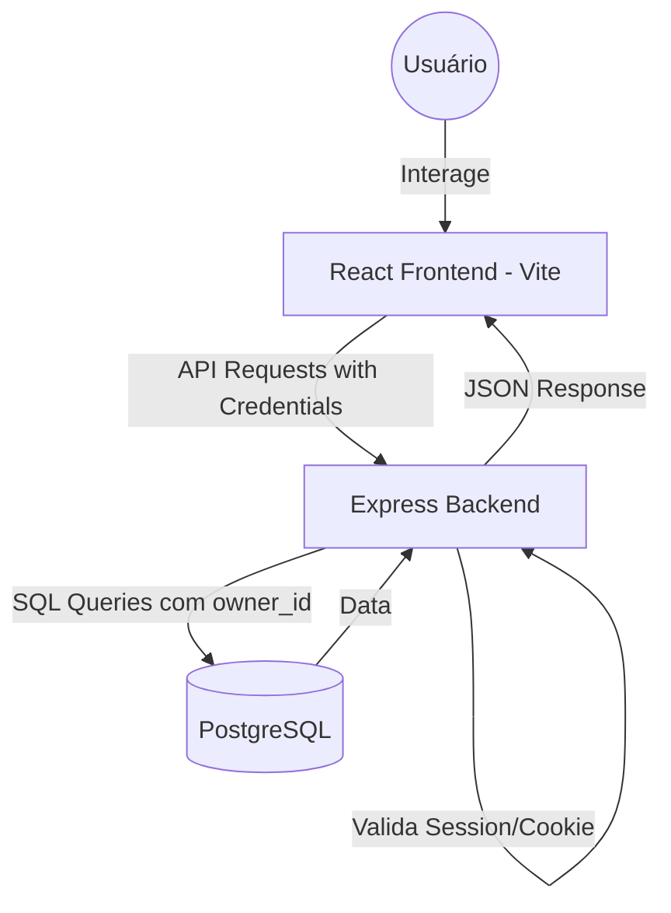

# 🚀 Gerenciador de Projetos - Kanban SaaS Ready

Uma aplicação **Full-Stack Enterprise-Level** para gerenciamento de projetos e tarefas, desenvolvida com foco em **Segurança Sênior**, **Performance Reativa** e **Arquitetura Escalável**.

---

## 🛡️ Destaques de Segurança (Senior Level)

Diferente de aplicações comuns de estudo, este projeto implementa padrões de segurança exigidos pelo mercado:

- **Autenticação via httpOnly Cookies**: O token JWT é armazenado em cookies seguros, protegendo a aplicação contra ataques de **XSS (Cross-Site Scripting)**.
- **Proteção CSRF**: Uso de flags `SameSite: Strict` para mitigar ataques de falsificação de requisição.
- **Validação Robusta no Backend**: Sanitização e validação de dados (como emails) via `validator.js` antes de qualquer persistência.
- **Segurança JWT**: Configuração estritamente baseada em variáveis de ambiente, sem fallbacks inseguros.
- **Isolamento de Dados (Multi-tenant)**: Todas as queries SQL garantem que um usuário só acesse seus próprios projetos e tarefas (`owner_id` enforcement).

---

## ⚡ Performance & UX

- **Estado Local Otimizado**: O Dashboard (Kanban) utiliza atualizações de estado local no React para refletir ações (criar, mover, excluir) instantaneamente, reduzindo drasticamente a latência e o número de requisições ao servidor.
- **Roteamento Preventivo**: Componente `ProtectedRoute` que valida a sessão com o backend (`/me`) antes de renderizar páginas privadas, evitando vazamento de UI.
- **Design Moderno**: Interface limpa construída com TailwindCSS, focada em produtividade.

---

## 🛠️ Tech Stack

### Backend
- **Core**: Node.js & Express.js
- **Banco de Dados**: PostgreSQL
- **Segurança**: JSON Web Tokens (JWT), bcrypt, cookie-parser, validator
- **Tooling**: Nodemon, dotenv

### Frontend
- **Framework**: React 18 (Vite)
- **Estilização**: TailwindCSS
- **Formulários**: React Hook Form & Zod
- **Comunicação**: Axios (Configurado para credenciais/cookies)

---

## 🏗️ Arquitetura



---

## ⚙️ Configuração do Ambiente

### 1. Banco de Dados
Certifique-se de ter o PostgreSQL rodando e crie o banco:
```bash
createdb gerenciador_projetos_sql
psql -d gerenciador_projetos_sql -f backend/schema.sql
```

### 2. Backend
```bash
cd backend
npm install
```
Crie um arquivo `.env`:
```env
PORT=5000
JWT_SECRET=sua_chave_secreta_longa_e_segura
DB_HOST=localhost
DB_PORT=5432
DB_USER=seu_usuario
DB_PASSWORD=sua_senha
DB_NAME=gerenciador_projetos_sql
CLIENT_ORIGIN=http://localhost:5173
```
Execute: `npm start` (ou `npm run dev`)

### 3. Frontend
```bash
cd client
npm install
npm run dev
```

---

## 🎯 Funcionalidades Atuais

- **Quadro Kanban**: 3 estágios (Para fazer, Em andamento, Concluído).
- **Drag & Drop**: Movimentação fluida de tickets.
- **Gestão de Tarefas**: Checklists dentro de cada projeto.
- **Sessão Persistente**: Login seguro que se mantém após o refresh da página.
- **Logout Seguro**: Limpeza completa de cookies no lado do servidor e cliente.

---

## 🚀 Próximos Passos (SaaS Roadmap)

- [ ] Implementação de Planos (Free vs Premium).
- [ ] Sistema de Billing (Stripe Integration).
- [ ] Dashboards de métricas por projeto.
- [ ] Notificações em tempo real.

---

## 📄 Licença

Este projeto está sob a licença ISC. Desenvolvido por [Douglas Scarello](https://github.com/DouglasScarello).
